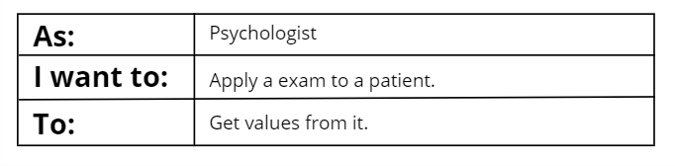

# User Cases

In order to organize the functionalities of the software, we divide them based on who is using the program and for what reason they are using it. In this project, there would be two kinds of users who can manipulate the program. One is the psychologist, and the other one is the patient. The functionalities available for each role are:

## Pyschologist

It would the the administrator of the software, the functionalites to this role are:

## Patient

This role is related tho the patient that the exam would be apply to. The functionalities of this role are:

