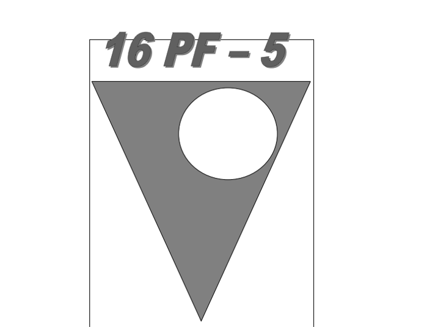

# Introduction.

This project revolves around psychology exams, where the application not only administers the exams but also efficiently manages patient controls.

This project emerged from the necessity observed in hospital settings, where psychologists administer exams to medical professionals. The traditional approach involves printing exams, leading to excessive paper usage. Compounding the issue, if the psychologist wishes to re-administer the exam, they are compelled to print it anew.

To address this challenge, we propose the implementation of a software solution. This software provides psychologists with digital access to the same exams, allowing for multiple applications without the need for repeated paper consumption. This not only enhances efficiency but also reduces environmental impact.

The software features an intuitive initial menu, offering psychologists a comprehensive view of patients who have undergone exams. Additionally, psychologists can create and manage patient profiles directly from this menu. Tasks such as creating new patients, deleting profiles, and administering exams to listed patients are seamlessly integrated.

Administrators have access to additional functionalities, including the ability to review patient exams, delete specific exams, and inspect individual questions within each exam. Notably, the software safeguards the integrity of completed exams, preventing any alterations or deletions.

Another key feature is the exam application process. Psychologists can select any patient from the list and administer the exam digitally. The patient must answer all questions to complete the exam. Upon completion, psychologists can conveniently review the results from the main menu, streamlining the assessment process.

This software not only addresses the logistical challenges of exam administration but also offers a user-friendly interface that enhances the overall experience for both psychologists and administrators.

## Metodology

The project will encompass three primary iterations, each focusing on distinct aspects of development. The initial iterations will primarily revolve around documentation and diagram representations. The second phase will emphasize code development and organizational structures. The final iteration will culminate in the delivery of the ultimate code version, incorporating bug fixes and optimizations for a polished final product.

For the organizational structure, we plan to adopt an MVC (Model-View-Controller) architecture for the project, with a primary emphasis on a well-organized and efficient web-based structure.